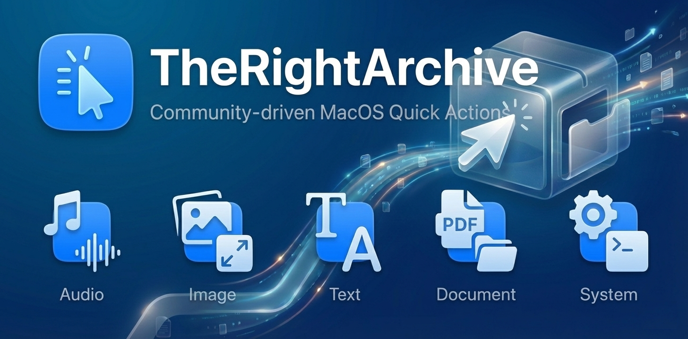

# TheRightArchive

TheRightArchive is a community-driven repository dedicated to preserving and sharing high-quality MacOS right-click extensions (Quick Actions). It serves as the underlying library for TheRightClick platform, ensuring that powerful automation tools are accessible to everyone.

## Mission

Our goal is to simplify MacOS automation. We make it easier for users to find the tools they need and for developers to share their creations with a broader audience.

## How It Works

This repository hosts raw .workflow bundles. These are standard MacOS Automator workflows that can be installed as Quick Actions, Services, or Applications. Every package is released and maintained in its own dedicated branch.

### Categories

Extensions are categorized to facilitate easy navigation:

- **Audio**: Operations involving sound files, such as compression, format conversion, and extraction.
- **Image**: Tools for image manipulation, resizing, background removal, and format changing.
- **Text**: Utilities for text transformation, clipboard management, and coding helpers.
- **Document**: Workflows for PDF handling, file conversion, and organization.
- **System**: General system utilities, finder operations, and maintenance scripts.

## Contributing

We welcome community contributions. However, to ensure consistency and proper metadata formatting, we strongly encourage using **TheRightClick** web application to publish new extensions rather than submitting Pull Requests directly to this repository.

The platform automatically handles validation, packaging, and categorization, making the process smoother for both creators and users.

### How to Publish

1. Access TheRightClick application.
2. Navigate to the "Create" section.
3. Upload your .workflow file and fill in the required details.
4. Your extension will be automatically added to TheRightArchive upon approval.

If you must submit manually via GitHub (e.g., for bulk archival or maintenance), please ensure you follow the strict directory structure and metadata requirements.

Please ensure your workflow does not contain sensitive personal data or hardcoded paths specific to your machine.

## Disclaimer

While we strive to curate safe and functional workflows, all extensions are provided as-is. We recommend reviewing the contents of any script before execution.

## License

This repository is open source. Content is available under the MIT License. By publishing an extension on TheRightClick platform, you agree that it will be published on TheRightArchive under the MIT license.
